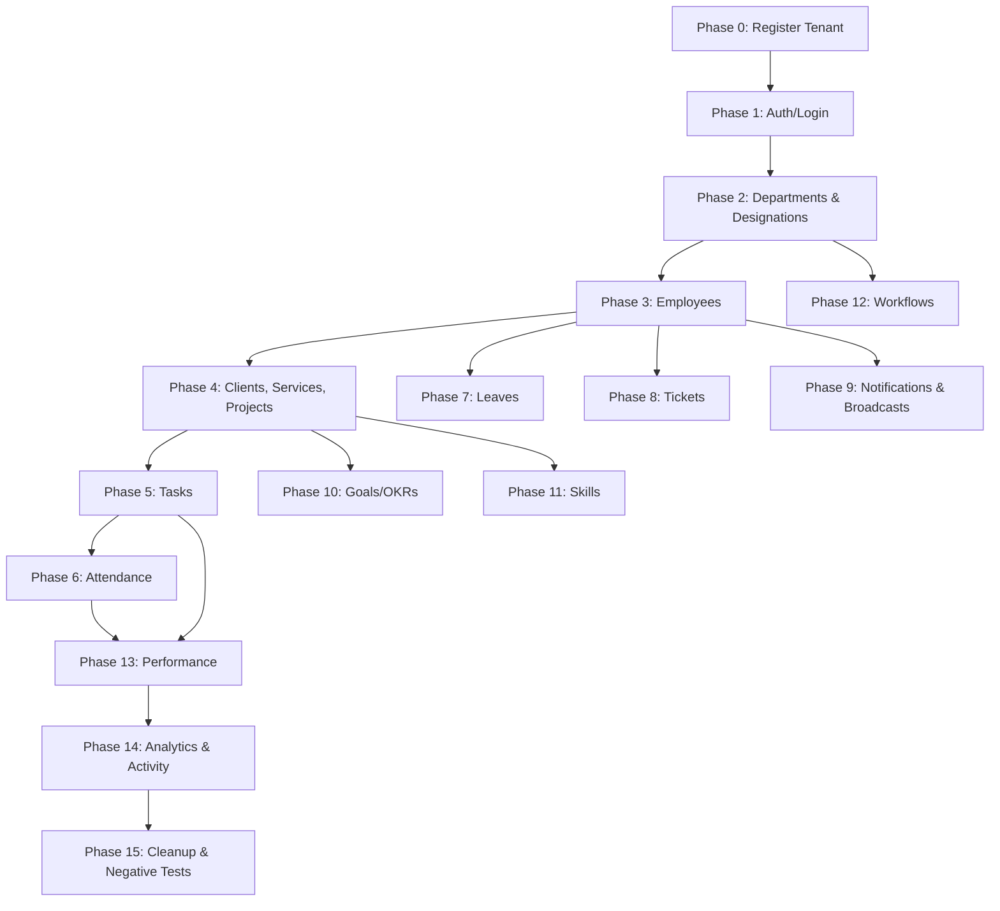

# 🧪 Avanzo Dashboard — API Testing Order

> **Base URL**: `http://<tenant-subdomain>.localhost:8000`
> **Auth**: All endpoints (except Login & Register) require `Authorization: Bearer <access_token>`
> **Multi-Tenant**: Subdomain determines tenant. Use tenant subdomain in the URL host.

---

## Phase 0 — Tenant Registration (Public Schema)

> Hit the **base domain** (no subdomain), e.g. `http://localhost:8000`

### 0.1 Register New Organization
```
POST /api/register/
No Auth Required
```
```json
{
  "company_name": "Avanzo Test Corp",
  "subdomain": "avanzo-test",
  "admin_email": "admin@avanzo.com",
  "admin_password": "SecurePass@2026",
  "admin_first_name": "Saron",
  "admin_last_name": "Admin"
}
```
✅ **Expected**: `201` — `"Workspace provisioned successfully."`

---

## Phase 1 — Authentication

> Switch to tenant URL: `http://avanzo-test.localhost:8000`

### 1.1 Login (Get JWT Tokens)
```
POST /api/auth/login/
No Auth Required
```
```json
{
  "email": "admin@avanzo.com",
  "password": "SecurePass@2026"
}
```
✅ **Expected**: `200` — Returns `access` and `refresh` tokens
📌 **Save** `access` and `refresh` tokens for all subsequent requests.

### 1.2 Get Current User Profile
```
GET /api/auth/me/
Auth: Bearer <access_token>
```
✅ **Expected**: `200` — User profile with `id`, `email`, `role`, `department_name`

### 1.3 Update Current User Profile
```
PATCH /api/auth/me/
Auth: Bearer <access_token>
```
```json
{
  "first_name": "Saron",
  "last_name": "CEO",
  "phone": "+91-9876543210"
}
```
✅ **Expected**: `200` — Updated profile

### 1.4 Refresh Token
```
POST /api/auth/refresh/
No Auth Required
```
```json
{
  "refresh": "<refresh_token>"
}
```
✅ **Expected**: `200` — New `access` token

### 1.5 List Access Roles
```
GET /api/auth/roles/
Auth: Bearer <access_token>
```
✅ **Expected**: `200` — List of 4 roles: Employee, Team Lead, HR, Admin

---

## Phase 2 — Organization Setup

> 🚨 **Must create Departments & Designations BEFORE creating employees** (FK dependency)

### 2.1 Create Department
```
POST /api/organization/departments/
Auth: Bearer <access_token> (Admin/HR only)
```
```json
{ "name": "Engineering" }
```
✅ **Expected**: `201` — Returns department with `id`
📌 **Save** department `id`. Repeat for: `Cybersecurity`, `Design`, `Marketing`

### 2.2 List Departments
```
GET /api/organization/departments/
```
✅ **Expected**: `200` — Array of departments

### 2.3 Create Designation
```
POST /api/organization/designations/
Auth: Bearer <access_token>
```
```json
{ "name": "Software Engineer" }
```
✅ **Expected**: `201`
📌 Repeat for: `SecOps Lead`, `UX Researcher`, `Team Lead`, `HR Manager`

### 2.4 List Designations
```
GET /api/organization/designations/
```
✅ **Expected**: `200`

---

## Phase 3 — Employee Management

> Requires: Roles (Phase 1.5), Departments & Designations (Phase 2)

### 3.1 Create Employee (as Admin)
```
POST /api/auth/employees/
Auth: Bearer <access_token> (Admin/HR only)
```
```json
{
  "email": "arjun@avanzo.com",
  "password": "ArjunPass@2026",
  "first_name": "Arjun",
  "last_name": "Developer",
  "access_role": "<Employee_role_uuid>",
  "department": "<Engineering_dept_uuid>",
  "designation": "<Software_Engineer_uuid>",
  "team_lead": "<admin_user_uuid>",
  "date_of_joining": "2026-01-15"
}
```
✅ **Expected**: `201`
📌 **Create at least 3 employees**:
- `arjun@avanzo.com` — Employee role
- `priya@avanzo.com` — Team Lead role
- `hr@avanzo.com` — HR role

### 3.2 List Employees
```
GET /api/auth/employees/
```
✅ **Expected**: `200` — Paginated list

### 3.3 Get Single Employee
```
GET /api/auth/employees/<employee_uuid>/
```

### 3.4 Update Employee
```
PATCH /api/auth/employees/<employee_uuid>/
```
```json
{ "phone": "+91-1234567890" }
```

### 3.5 🔄 Login as Team Lead
```
POST /api/auth/login/
```
```json
{
  "email": "priya@avanzo.com",
  "password": "PriyaPass@2026"
}
```
📌 **Save** TL token for Team Lead-specific endpoints.

### 3.6 🔄 Login as HR
```
POST /api/auth/login/
```
```json
{
  "email": "hr@avanzo.com",
  "password": "HrPass@20260!"
}
```
📌 **Save** HR token for HR-specific endpoints.

---

## Phase 4 — Projects Module

> Requires: Departments (Phase 2), Employees (Phase 3)

### 4.1 Create External Client
```
POST /api/projects/clients/
Auth: Bearer <admin_token>
```
```json
{
  "name": "Acme Corporation",
  "contact_email": "contact@acme.com",
  "industry": "Technology"
}
```
✅ **Expected**: `201`
📌 **Save** client `id`

### 4.2 List Clients
```
GET /api/projects/clients/
```

### 4.3 Create Service
```
POST /api/projects/services/
```
```json
{
  "name": "VPT Audit",
  "description": "Vulnerability & Penetration Testing"
}
```
📌 **Save** service `id`

### 4.4 List Services
```
GET /api/projects/services/
```

### 4.5 Create External Project
```
POST /api/projects/projects/
Auth: Bearer <admin_token>
```
```json
{
  "title": "Acme Security Audit Q2",
  "is_internal": false,
  "client": "<acme_client_uuid>",
  "service": "<vpt_audit_service_uuid>",
  "owning_department": "<cybersecurity_dept_uuid>",
  "team": ["<arjun_uuid>", "<priya_uuid>"],
  "start_date": "2026-04-01",
  "target_end_date": "2026-06-30"
}
```
✅ **Expected**: `201` — `manager` auto-set to request user, `status` defaults to `draft`
📌 **Save** project `id`

### 4.6 Create Internal Project
```
POST /api/projects/projects/
```
```json
{
  "title": "Dashboard v2 Redesign",
  "is_internal": true,
  "owning_department": "<engineering_dept_uuid>",
  "team": ["<arjun_uuid>"],
  "start_date": "2026-04-01",
  "target_end_date": "2026-07-31"
}
```

### 4.7 List Projects
```
GET /api/projects/projects/
```

### 4.8 Get Project Detail
```
GET /api/projects/projects/<project_uuid>/
```

### 4.9 Get Project Progress
```
GET /api/projects/projects/<project_uuid>/progress/
```
✅ **Expected**: `200` — `weighted_progress`, `total_tasks`, `completed_tasks`, `formula`

---

## Phase 5 — Tasks

> Requires: Projects (Phase 4), Employees on project team

### 5.1 Create Task
```
POST /api/projects/tasks/
Auth: Bearer <admin_token>
```
```json
{
  "project": "<project_uuid>",
  "title": "Implement JWT Authentication",
  "description": "Set up JWT auth with refresh token rotation",
  "assignee": "<arjun_uuid>",
  "priority": "high",
  "complexity": 7,
  "start_date": "2026-04-17",
  "due_date": "2026-04-25",
  "estimated_hours": 16.00
}
```
✅ **Expected**: `201` — `status` defaults to `open`, `completion_pct` = 0
📌 **Save** task `id`. Create 2-3 tasks.

### 5.2 List Tasks
```
GET /api/projects/tasks/
```

### 5.3 Update Task Progress
```
PATCH /api/projects/tasks/<task_uuid>/progress/
Auth: Bearer <arjun_token>
```
```json
{ "completion_pct": 50 }
```
✅ **Expected**: `200` — `complexity_locked` becomes `true` after first progress update

### 5.4 Get Estimation Suggestion
```
GET /api/projects/tasks/estimate-suggestion/
```

---

## Phase 6 — Attendance

> Requires: Projects & Tasks (Phase 4-5) for structured entries

### 6.1 Clock In (Morning Gate)
```
POST /api/attendance/clock-in/
Auth: Bearer <arjun_token>
```
```json
{
  "entries": [
    {
      "project": "<project_uuid>",
      "task": "<task_uuid>",
      "intent_text": "Complete the JWT authentication middleware and write unit tests",
      "morning_confidence": 4,
      "priority_order": 0
    },
    {
      "custom_label": "Code Reviews",
      "intent_text": "Review three pending pull requests from the team",
      "priority_order": 1
    }
  ],
  "general_notes": "Team standup at 10am"
}
```
✅ **Expected**: `201` — DailyLog with status `clocked_in`, entries created

### 6.2 Get Today's Record
```
GET /api/attendance/today/
Auth: Bearer <arjun_token>
```
✅ **Expected**: `200` — Today's log with entries
📌 **Save** `entry_id` values from the response for clock-out

### 6.3 Clock Out (Evening Gate)
```
PATCH /api/attendance/clock-out/
Auth: Bearer <arjun_token>
```
```json
{
  "entries": [
    {
      "entry_id": "<entry_uuid_1>",
      "output_text": "Finished JWT middleware implementation and merged PR",
      "outcome": "completed"
    },
    {
      "entry_id": "<entry_uuid_2>",
      "output_text": "Reviewed two of three PRs, third needs more context",
      "outcome": "partial",
      "outcome_reason": "underestimated"
    }
  ],
  "general_notes": "Updated sprint board with progress"
}
```
✅ **Expected**: `200` — Status `clocked_out`, `total_hours` computed

### 6.4 List Attendance History
```
GET /api/attendance/
Auth: Bearer <arjun_token>
```

### 6.5 Team Feed (Team Lead Only)
```
GET /api/attendance/team-feed/
Auth: Bearer <tl_token>
```
✅ **Expected**: `200` — Feed of direct reports with status and entries

### 6.6 Org Pulse (Admin Only)
```
GET /api/attendance/pulse/
Auth: Bearer <admin_token>
```
✅ **Expected**: `200` — Org-wide attendance summary

### 6.7 Attendance Report
```
GET /api/attendance/reports/
Auth: Bearer <admin_token>
```

---

## Phase 7 — Leaves

> Requires: Employees (Phase 3), Team Lead & HR accounts

### 7.1 Apply for Leave (Employee)
```
POST /api/leaves/requests/
Auth: Bearer <arjun_token>
```
```json
{
  "leave_type": "casual",
  "start_date": "2026-04-25",
  "end_date": "2026-04-26",
  "reason": "Family function — need two days off for a wedding"
}
```
✅ **Expected**: `201` — Status `pending`, `total_days` = 2
📌 **Save** leave request `id`

### 7.2 List Leave Requests
```
GET /api/leaves/requests/
Auth: Bearer <arjun_token>
```

### 7.3 TL Approve (Team Lead)
```
PATCH /api/leaves/requests/<leave_uuid>/tl_approve/
Auth: Bearer <tl_token>
```
```json
{ "comment": "Approved. Enjoy the wedding!" }
```
✅ **Expected**: `200` — Status → `tl_approved`

### 7.4 HR Approve (Final)
```
PATCH /api/leaves/requests/<leave_uuid>/hr_approve/
Auth: Bearer <hr_token>
```
```json
{ "comment": "Final approval granted. Leave balance updated." }
```
✅ **Expected**: `200` — Status → `approved`

### 7.5 Apply & Reject Leave (Negative Test)
```
POST /api/leaves/requests/  → create new leave
PATCH /api/leaves/requests/<id>/reject/
Auth: Bearer <tl_token>
```
```json
{ "comment": "Sorry, we have a critical deadline that week." }
```
✅ **Expected**: `200` — Status → `rejected`

### 7.6 Leave History (HR/Admin)
```
GET /api/leaves/requests/history/
Auth: Bearer <hr_token>
```

---

## Phase 8 — Tickets

> Requires: Employees (Phase 3)

### 8.1 Create Ticket (Employee)
```
POST /api/tickets/
Auth: Bearer <arjun_token>
```
```json
{
  "ticket_type": "capacity",
  "title": "Overloaded with 5 concurrent projects",
  "description": "I am currently assigned to 5 projects simultaneously which is affecting my productivity and quality of work significantly."
}
```
✅ **Expected**: `201` — `task_snapshot` auto-captured for capacity tickets

### 8.2 List All Tickets
```
GET /api/tickets/
```

### 8.3 My Tickets
```
GET /api/tickets/mine/
Auth: Bearer <arjun_token>
```

### 8.4 Assigned to Me
```
GET /api/tickets/assigned/
Auth: Bearer <tl_token>
```

### 8.5 Mark In Review
```
PATCH /api/tickets/<ticket_uuid>/review/
Auth: Bearer <tl_token>
```
✅ **Expected**: `200` — Status → `in_review`

### 8.6 Resolve Ticket
```
PATCH /api/tickets/<ticket_uuid>/resolve/
Auth: Bearer <tl_token>
```
```json
{
  "resolution_note": "Redistributed two projects to other team members. Workload reduced to 3 projects."
}
```
✅ **Expected**: `200` — Status → `resolved`

---

## Phase 9 — Notifications & Broadcasts

### 9.1 List Notifications
```
GET /api/notifications/notifications/
Auth: Bearer <arjun_token>
```
✅ **Expected**: `200` — Unread notifications (auto-generated from leaves, tickets, etc.)

### 9.2 Mark Single as Read
```
PATCH /api/notifications/notifications/<notification_uuid>/read/
```

### 9.3 Mark All as Read
```
PATCH /api/notifications/notifications/read-all/
```

### 9.4 Create Broadcast (HR/Admin)
```
POST /api/notifications/broadcasts/
Auth: Bearer <admin_token>
```
```json
{
  "title": "Office Closed for Diwali",
  "message": "The office will remain closed from Oct 28 to Oct 31 for Diwali celebrations.",
  "severity": "info",
  "target_scope": "org_wide"
}
```
✅ **Expected**: `201`
📌 **Save** broadcast `id`

### 9.5 Create Department Broadcast
```
POST /api/notifications/broadcasts/
Auth: Bearer <admin_token>
```
```json
{
  "title": "Mandatory Security Training",
  "message": "All Cybersecurity team members must complete the OWASP training by Friday.",
  "severity": "critical",
  "target_scope": "department",
  "department": "<cybersecurity_dept_uuid>"
}
```

### 9.6 Acknowledge Broadcast
```
POST /api/notifications/broadcasts/<broadcast_uuid>/acknowledge/
Auth: Bearer <arjun_token>
```

### 9.7 Broadcast Stats (HR/Admin)
```
GET /api/notifications/broadcasts/<broadcast_uuid>/stats/
Auth: Bearer <admin_token>
```

---

## Phase 10 — Goals & OKRs

> Requires: Departments (Phase 2), Projects (Phase 4), Employees (Phase 3)

### 10.1 Create Company Objective
```
POST /api/goals/objectives/
Auth: Bearer <admin_token>
```
```json
{
  "title": "Achieve 95% Client Retention Rate",
  "description": "Improve service delivery to retain all major clients",
  "level": "company",
  "cadence": "quarterly",
  "period_start": "2026-04-01",
  "period_end": "2026-06-30"
}
```
✅ **Expected**: `201` — `owner` auto-set to requesting user
📌 **Save** objective `id`

### 10.2 Create Department Objective
```
POST /api/goals/objectives/
```
```json
{
  "title": "Reduce Mean Time to Resolution",
  "level": "department",
  "cadence": "quarterly",
  "department": "<cybersecurity_dept_uuid>",
  "parent_objective": "<company_objective_uuid>",
  "period_start": "2026-04-01",
  "period_end": "2026-06-30"
}
```

### 10.3 Create Key Result
```
POST /api/goals/key-results/
Auth: Bearer <admin_token>
```
```json
{
  "objective": "<objective_uuid>",
  "title": "Complete 20 security audits",
  "tracking_type": "number",
  "target_value": 20,
  "owner": "<admin_uuid>"
}
```
📌 **Save** key result `id`

### 10.4 Create Auto-Project Key Result
```
POST /api/goals/key-results/
```
```json
{
  "objective": "<objective_uuid>",
  "title": "Finish Acme Security Audit",
  "tracking_type": "auto_project",
  "linked_project": "<project_uuid>",
  "owner": "<admin_uuid>"
}
```

### 10.5 Update Key Result Value
```
PATCH /api/goals/key-results/<kr_uuid>/update-progress/
```
```json
{
  "new_value": 8,
  "note": "Completed 8 audits this month"
}
```

### 10.6 List Objectives
```
GET /api/goals/objectives/
```

### 10.7 My OKRs
```
GET /api/goals/my-okrs/
Auth: Bearer <arjun_token>
```
✅ **Expected**: `200` — Objectives assigned to the current user with nested KRs

### 10.8 OKR Dashboard
```
GET /api/goals/dashboard/
```
✅ **Expected**: `200` — `company_objectives` + `department_objectives` with nested KRs

---

## Phase 11 — Skills

> Requires: Employees (Phase 3), Projects (Phase 4)

### 11.1 Create Skill (Catalog)
```
POST /api/skills/catalog/
Auth: Bearer <admin_token>
```
```json
{
  "name": "Penetration Testing",
  "category": "cybersecurity",
  "description": "Ability to perform authorized simulated attacks"
}
```
📌 Repeat for: `Django` (development), `React` (development), `Figma` (design)

### 11.2 List Skills
```
GET /api/skills/catalog/
```

### 11.3 Assign Employee Skill
```
POST /api/skills/employees/
Auth: Bearer <admin_token>
```
```json
{
  "employee": "<arjun_uuid>",
  "skill": "<django_skill_uuid>",
  "proficiency": 3,
  "verified_by": "<tl_uuid>"
}
```

### 11.4 My Skills
```
GET /api/skills/employees/my-skills/
Auth: Bearer <arjun_token>
```

### 11.5 Create Project Skill Requirement
```
POST /api/skills/requirements/
Auth: Bearer <admin_token>
```
```json
{
  "project": "<project_uuid>",
  "skill": "<pentest_skill_uuid>",
  "min_proficiency": 3,
  "headcount_needed": 2
}
```

### 11.6 Skill Match
```
GET /api/skills/match/?project_id=<project_uuid>
```
✅ **Expected**: `200` — Matching candidates per requirement

### 11.7 Skill Gaps
```
GET /api/skills/gaps/
```
✅ **Expected**: `200` — Unfilled requirements

---

## Phase 12 — Workflows

> Requires: Departments (Phase 2), Employees (Phase 3)

### 12.1 Create Workflow Template
```
POST /api/workflows/templates/
Auth: Bearer <admin_token>
```
```json
{
  "name": "Engineering Onboarding",
  "workflow_type": "onboarding",
  "department": "<engineering_dept_uuid>",
  "is_active": true,
  "steps": [
    {
      "title": "Create company email",
      "description": "Set up @avanzo.com email account",
      "assigned_role": "IT",
      "order": 1,
      "due_days": 1,
      "is_required": true
    },
    {
      "title": "Assign laptop & peripherals",
      "description": "Configure dev machine with required software",
      "assigned_role": "IT",
      "order": 2,
      "due_days": 2,
      "is_required": true
    },
    {
      "title": "Schedule intro meetings",
      "description": "Book 1:1s with team members and manager",
      "assigned_role": "HR",
      "order": 3,
      "due_days": 3,
      "is_required": false
    }
  ]
}
```
✅ **Expected**: `201` — Template with nested steps
📌 **Save** template `id`

### 12.2 List Templates
```
GET /api/workflows/templates/
```

### 12.3 Activate Workflow for Employee
```
POST /api/workflows/activate/
Auth: Bearer <admin_token>
```
```json
{
  "employee": "<arjun_uuid>",
  "template": "<template_uuid>"
}
```
✅ **Expected**: `201` — Workflow with step instances + due dates calculated
📌 **Save** workflow `id` and step instance `id`s

### 12.4 List Active Workflows
```
GET /api/workflows/active/
```

### 12.5 My Tasks (Assigned Steps)
```
GET /api/workflows/my-tasks/
Auth: Bearer <hr_token>
```

### 12.6 Complete a Step
```
POST /api/workflows/steps/<step_instance_uuid>/complete/
Auth: Bearer <hr_token>
```
```json
{ "notes": "Email account created successfully" }
```

### 12.7 Overdue Steps
```
GET /api/workflows/overdue/
```

---

## Phase 13 — Performance

> Requires: Attendance data, Tasks, Projects (Phases 4-6)

### 13.1 Get My Score
```
GET /api/performance/my-score/
Auth: Bearer <arjun_token>
```
✅ **Expected**: `200` — Composite score with breakdown (attendance, delivery, quality, reliability)

### 13.2 Team Scores (Team Lead)
```
GET /api/performance/team-scores/
Auth: Bearer <tl_token>
```

### 13.3 Leaderboard
```
GET /api/performance/leaderboard/
Auth: Bearer <admin_token>
```

### 13.4 Score History
```
GET /api/performance/history/
Auth: Bearer <arjun_token>
```

### 13.5 Performance Config (Admin)
```
GET /api/performance/config/
Auth: Bearer <admin_token>
```

---

## Phase 14 — Analytics & Activity Feed

### 14.1 Admin Dashboard Analytics
```
GET /api/analytics/admin/dashboard/
Auth: Bearer <admin_token>
```

### 14.2 Department Health Heatmap
```
GET /api/analytics/admin/department-health/
Auth: Bearer <admin_token>
```
✅ **Expected**: `200` — Department health metrics

### 14.3 Velocity
```
GET /api/admin/velocity/
Auth: Bearer <admin_token>
```
✅ **Expected**: `200` — Team velocity metrics (tasks per hour)

### 14.4 Activity Feed
```
GET /api/activity/feed/
Auth: Bearer <admin_token>
```
✅ **Expected**: `200` — Paginated list of recent system activities

### 14.5 Activity Summary
```
GET /api/activity/summary/
Auth: Bearer <admin_token>
```

---

## Phase 15 — Cleanup & Negative Tests

### 15.1 Logout
```
POST /api/auth/logout/
Auth: Bearer <access_token>
```
```json
{ "refresh": "<refresh_token>" }
```
✅ **Expected**: `200` — Token blacklisted

### 15.2 Verify Token Blacklisted
```
GET /api/auth/me/
Auth: Bearer <old_access_token>
```
✅ **Expected**: `401` — Unauthorized

### 15.3 Brute-Force Lockout Test
```
POST /api/auth/login/   ×5 with wrong password
```
✅ **Expected**: `429` on 6th attempt — Account locked for 15 minutes

---

## 📋 Quick Reference — Dependency Graph



## 📊 Endpoint Count Summary

| Module | Endpoints | Methods |
|--------|-----------|---------|
| Auth | 6 | GET, POST, PATCH |
| Organization | 4 | GET, POST, PATCH, DELETE |
| Employees | 4 | GET, POST, PATCH, DELETE |
| Projects | 9 | GET, POST, PATCH |
| Tasks | 4 | GET, POST, PATCH |
| Attendance | 7 | GET, POST, PATCH |
| Leaves | 6 | GET, POST, PATCH |
| Tickets | 6 | GET, POST, PATCH |
| Notifications | 7 | GET, POST, PATCH |
| Goals/OKRs | 6 | GET, POST, PATCH |
| Skills | 7 | GET, POST |
| Workflows | 7 | GET, POST |
| Performance | 5 | GET |
| Analytics | 3 | GET |
| Activity | 2 | GET |
| **Total** | **~83** | |
